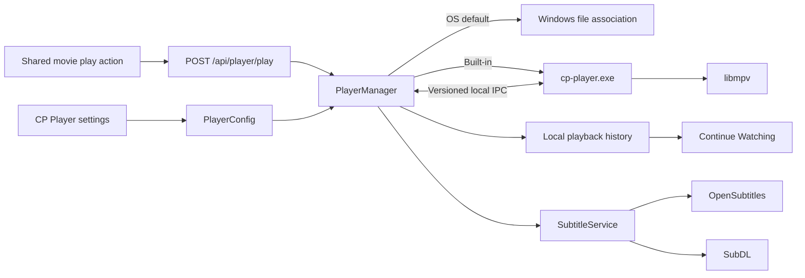

# Cinema Paradiso Native Player — Zero-Regression Implementation Plan

- **Status:** Approved architecture and implementation plan; implementation has not started.
- **Date:** 2026-07-28
- **Target:** Cinema Paradiso on Windows 10/11 x64
- **Decision:** Add an optional CP-branded native player built with Qt Quick/QML and bundled `libmpv`, while preserving the operating-system default player as a first-class setting.

## 1. Objective

Cinema Paradiso currently opens local movies through the Windows file association. That is reliable, but CP cannot observe playback position, audio/subtitle selection, completion, or player errors. It therefore cannot provide a trustworthy Continue Watching experience.

The approved direction is to add a premium, CP-integrated player that:

- looks and behaves like part of Cinema Paradiso;
- uses `libmpv` for mature decoding, seeking, track handling, hardware acceleration, and subtitle support;
- records playback progress locally;
- supplies Continue Watching and resume playback;
- supports multilingual audio and embedded/external subtitles;
- searches multiple subtitle providers when the user presses `D`;
- remains optional, with the current operating-system player retained in Settings;
- does not modify media files or register itself as the Windows default application.

This is not a request to build a new decoder. CP will own the product experience, interface, state, and integration; `libmpv` will remain the authoritative playback engine.

## 2. Critical Precondition

The current checkout contains substantial uncommitted work in areas this feature will touch, including backend routes, Settings, Home, shared cards, catalog persistence, packaging, and tests.

Before player implementation begins:

1. Inspect the complete Git status and diff so every existing change is understood.
2. Review the existing work with Dante and obtain explicit approval for the exact checkpoint scope.
3. Save all approved existing work in one or more intentional Git commits before changing any player code.
4. Record the checkpoint commit SHA in the player implementation handoff.
5. Verify that `git status --short` is clean, except for files Dante explicitly chooses to leave outside the checkpoint.
6. Establish a known-good build and targeted test baseline from that committed state.
7. Identify any overlapping incomplete schema or UI work.
8. Start player implementation only after Dante explicitly approves proceeding from the verified checkpoint.
9. Do not mix unrelated cleanup into the player changes.

The native player must be delivered in reviewable phases. It must not be attempted as one large patch.

Creating this plan does not authorize a commit. The checkpoint commit remains a separate approval-gated action.

## 3. Product Decisions

### 3.1 Player modes

CP will expose two explicit playback modes:

- **Operating-system default player:** preserve the current Windows behavior.
- **Cinema Paradiso built-in player:** launch the bundled CP player.

Existing installations remain on the operating-system player when the feature first ships. The built-in player is opt-in until its runtime, packaging, recovery, and long-play tests are proven.

Changing the mode affects the next playback launch. It does not terminate or replace a movie already playing.

### 3.2 Desktop scope

The initial player is desktop-only. It will be designed and verified for Windows desktop layouts and display scaling from 100% through 200%. Mobile and responsive-player work is out of scope.

### 3.3 One active playback session

The first release supports one active CP playback session. If the user attempts to open another movie, CP focuses the existing player and asks whether to replace the current movie.

### 3.4 Fallback behavior

If the bundled runtime is missing, corrupted, incompatible, or fails its handshake:

- show a clear error;
- offer to open that movie with the operating-system player;
- do not silently change the saved player preference;
- do not leave a dead background process.

## 4. Authoritative Architecture

The native player will be a separately packaged helper process:

- **Executable:** `cp-player.exe`
- **Interface:** C++ with Qt Quick/QML
- **Playback engine:** bundled `libmpv` using mpv's supported client/render API
- **Coordination:** versioned local IPC with the CP backend
- **Visible controls:** entirely CP-owned QML; mpv's stock on-screen controller is disabled



### 4.1 Authoritative owners

Each responsibility must have one clear owner:

| Responsibility | Authoritative owner |
|---|---|
| Player mode and preferences | `PlayerConfig` |
| Starting, supervising, and stopping the native process | `PlayerManager` |
| Native controls and interaction | `cp-player.exe` QML interface |
| Decoding, seeking, tracks, synchronization, and rendering | `libmpv` |
| Playback progress | Local catalog playback table |
| Watched state | Existing `UserCurationStore` |
| Subtitle search, ranking, and download | `SubtitleService` |
| Runtime assembly and manifests | Portable release builder |
| CP visual identity | Shared generated player-theme tokens |

The current local-play path effectively calls `/api/open-file`, which delegates to `os.startfile()`. The player work will introduce one centralized `/api/player/play` action. After all local play callers have migrated and regression coverage proves parity, the obsolete route must be removed rather than retained as a parallel implementation.

## 5. Settings Contract

Player configuration belongs to a dedicated player configuration API, not library configuration:

- `GET /api/player/config`
- `PUT /api/player/config`
- `GET /api/player/status`
- `POST /api/player/verify`

The existing Settings workspace remains the UI owner.

### 5.1 Required preferences

- playback mode: `built_in` or `os_default`;
- preferred audio-language order;
- preferred subtitle-language order;
- forced-subtitle preference;
- hearing-impaired subtitle preference;
- resume enabled;
- minimum resumable position, initially 120 seconds;
- completion threshold, initially 92%;
- automatically mark completed movies watched;
- hardware decoding: safe automatic, off, or advanced;
- HDR handling: automatic by default;
- audio output and optional passthrough choices;
- subtitle storage: CP cache by default, or beside the movie only by explicit user choice;
- OpenSubtitles configuration;
- SubDL configuration;
- automatic subtitle search disabled by default;
- keyboard shortcut customization;
- reset player preferences.

### 5.2 Runtime status

The Settings card must display:

- Ready, missing, damaged, or incompatible state;
- CP player, mpv, and Qt versions;
- architecture;
- a **Verify player** action;
- license/source notices;
- operating-system fallback availability.

Secrets must be write-only in the interface and redacted from API responses, process arguments, logs, diagnostics, and screenshots.

## 6. Secure Launch and IPC

### 6.1 Playback launch

1. A movie card invokes the centralized local-play action.
2. The frontend posts the selected library identity to `/api/player/play`.
3. The backend resolves the canonical path through the SQL catalog.
4. The backend rejects missing files, non-library files, arbitrary paths, and remote URLs.
5. `PlayerManager` reads the active playback mode.
6. In OS mode, it delegates to the Windows file association.
7. In built-in mode, it:
   - validates the runtime manifest and executable;
   - creates a random session identifier and local named-pipe endpoint;
   - launches `cp-player.exe` without a command shell;
   - completes a versioned handshake;
   - sends the resolved file, canonical metadata, poster reference, saved position, and safe preferences.
8. The helper reports state, progress, tracks, errors, and closure.

Media paths, credentials, and reusable authorization tokens must not appear in the process command line.

### 6.2 Protocol

Use newline-delimited JSON with an explicit protocol version. Expected messages include:

- `hello`
- `load`
- `ready`
- `playback.state`
- `progress`
- `tracks.changed`
- `subtitle.search`
- `subtitle.results`
- `subtitle.download`
- `subtitle.loaded`
- `error`
- `closing`
- `closed`

The protocol must:

- reject incompatible versions cleanly;
- validate message shapes and bounds;
- use per-session authentication material;
- prevent another local process from trivially controlling the player;
- time out startup and shutdown operations;
- tolerate late, duplicated, and out-of-order progress messages;
- never allow the helper to choose arbitrary catalog paths.

## 7. Native Player Experience

The player must feel like Cinema Paradiso, not an mpv window with recolored buttons.

### 7.1 Visual language

- archive-black background;
- CP gold for active states and timeline progress;
- soft white primary text and muted secondary text;
- CP typography, radii, shadows, and spacing;
- restrained bottom control gradient;
- movie title, year, and current chapter at the top;
- central play/pause affordance;
- controls hidden after approximately 2.5 seconds while playing;
- controls remain visible while paused, seeking, or using a menu;
- proper keyboard focus, hover, pressed, and disabled states.

The visual tokens must not be maintained independently in React and QML. A shared player-theme source should generate:

- QML constants for the native helper;
- React/CSS variables for Settings, Continue Watching, and any player diagnostics.

### 7.2 Primary controls

- play and pause;
- seek backward and forward;
- clickable and draggable timeline;
- current time and total duration;
- hover thumbnail preview when available;
- chapter markers and chapter selection;
- volume and mute;
- audio-track panel;
- subtitle-track panel;
- player settings;
- fullscreen/windowed toggle;
- close.

Pressing `D` opens a CP-designed subtitle search panel. It must not expose provider implementation details as raw debug output.

### 7.3 First production capabilities

- broad local-container and codec playback without server transcoding;
- safe automatic hardware decoding;
- fullscreen and windowed modes;
- accurate timeline seeking;
- multilingual audio-track selection;
- embedded and external subtitles;
- position, duration, pause, and completion reporting;
- resume prompt;
- language preferences;
- volume, mute, and playback speed;
- subtitle and audio synchronization delay;
- crash-safe progress persistence.

### 7.4 Premium follow-up capabilities

- seek thumbnails;
- rich chapter navigation;
- subtitle font, size, position, color, border, and background controls;
- audio output, downmix, and supported passthrough choices;
- HDR passthrough and tone-mapping controls where supported;
- A-B repeat;
- frame advance;
- screenshots;
- aspect ratio, crop, zoom, pan, and rotation;
- playback statistics overlay;
- picture-in-picture or compact always-on-top window;
- customizable keyboard shortcuts;
- multi-monitor placement and remembered window state.

## 8. Keyboard Contract

Default shortcuts should be familiar but CP-owned and configurable:

| Key | Action |
|---|---|
| `Space` | Play/pause |
| `Left` / `Right` | Short seek |
| `Shift+Left` / `Shift+Right` | Longer seek |
| `Up` / `Down` | Volume |
| `M` | Mute |
| `F` or `Enter` | Fullscreen |
| `Esc` | Exit fullscreen or close the active overlay |
| `A` | Audio tracks |
| `S` | Subtitle tracks |
| `D` | Search subtitle providers |
| `[` / `]` | Playback speed |
| `Z` / `X` | Subtitle delay |
| `Ctrl+Z` / `Ctrl+X` | Audio delay |
| `C` | Chapters |
| `I` | Playback statistics |
| `P` | Screenshot |

Shortcuts must not fire while a text input is focused, and overlays must have deterministic keyboard focus and escape behavior.

## 9. Audio-Track Selection

Track selection must present useful names rather than raw mpv IDs. A label might read:

> Arabic — Dolby Digital Plus 5.1 — Default

Each track model should include, where available:

- language;
- title;
- codec;
- channel layout;
- default flag;
- forced flag;
- commentary/accessibility markers.

Automatic selection order:

1. the saved per-file track fingerprint;
2. the user's preferred language order;
3. the container's default or original-language track;
4. the first playable track.

Saved selections must use descriptive fingerprints rather than unstable numeric track indices.

## 10. Continue Watching and Playback History

The catalog already distinguishes a file identity (`path_key`) from canonical movie identity (`movie_key`). Playback state must preserve that distinction.

### 10.1 Schema direction

Only after the current catalog/schema-v9 work is stabilized, add an additive playback-history table equivalent to:

```text
playback_history
  path_key                    PRIMARY KEY
  movie_key                   NULLABLE
  position_ms
  duration_ms
  last_played_at
  completed_at                NULLABLE
  audio_track_fingerprint     NULLABLE
  subtitle_track_fingerprint  NULLABLE
  subtitle_delay_ms
  revision
```

The exact migration and constraints must follow the catalog's established schema owner and migration conventions.

### 10.2 Behavior

- Progress is file-specific because different copies may have different cuts and durations.
- `movie_key` groups copies for presentation and identity.
- Save progress every 15–20 seconds and on pause, seek completion, track changes, and normal close.
- A movie enters Continue Watching after the minimum position and before the completion threshold.
- A movie completed beyond the configured threshold is removed from Continue Watching.
- Manual watched state excludes the movie from Continue Watching.
- Automatic completion calls the existing `UserCurationStore`; it does not create a second watched flag.
- Rename/move operations migrate progress through the authoritative catalog-mutation path.
- Removing a library file removes its file-specific progress through that same owner.
- Metadata correction may update `movie_key` without losing the file's `path_key` progress.

Progress writes must be monotonic where appropriate, revision-safe, and resistant to late events from an older playback session.

### 10.3 Home presentation

Add a full-width Continue Watching rail after the Home hero and before the existing Library Health / Followed Releases row. Hide the rail completely when there are no unfinished movies.

Use the existing stored portrait poster. Do not require landscape backdrop artwork for this surface. The poster must retain its original aspect ratio and must never be stretched or cropped merely to fill the tile.

The rail uses a compact `continue` presentation variant owned by the authoritative shared movie-card system. It is not the existing full Library/Discover card squeezed into a smaller container. The target desktop tile width is approximately 150–160 px, with a proportional 2:3 poster approximately 225–240 px high. Final dimensions remain subject to desktop visual verification.

Each tile contains only:

- the portrait poster;
- a Resume play overlay on hover/focus;
- a gold progress bar directly below the poster;
- the movie title below the progress bar;
- the estimated time remaining below the title;
- a compact menu with Restart and Remove from Continue Watching.

Do not include ratings, quality chips, plot, cast, expanded details, or the standard card action rows in this rail.

At the target 1920px desktop layout, the rail should expose approximately eight to nine complete tiles with the sidebar expanded and approximately ten with it collapsed. A partially visible next tile may be used to communicate horizontal scrolling. Provide mouse-wheel/trackpad scrolling and explicit left/right controls.

Removing a tile clears its resumable progress but does not mark the movie watched. Restart begins the exact saved file from the beginning. Resume opens the exact saved file at its stored position.

Do not fork a route-specific Home card implementation. Shared artwork fallback, title handling, interaction, color, focus, and accessibility behavior remain owned by the shared movie-card system.

## 11. Multi-Provider Subtitle Search

The subtitle experience should reproduce the useful behavior of MPC's `D` shortcut without copying its interface or tying CP to one provider.

### 11.1 Ownership

The CP backend owns:

- provider credentials;
- network requests;
- provider rate limits;
- search aggregation;
- ranking and deduplication;
- archive validation;
- subtitle cache paths;
- redacted diagnostics.

The native helper requests searches and displays safe results. It does not hold provider credentials or contact providers directly.

### 11.2 Initial providers

- OpenSubtitles
- SubDL

Adapters must implement one internal result model so another provider can be added without changing the QML result list.

### 11.3 Search identity

Use as much verified identity as available:

- IMDb ID;
- TMDB ID;
- title;
- year;
- release filename;
- file size;
- supported file hash;
- frame rate;
- requested languages.

### 11.4 Ranking

Rank results using:

1. exact supported file hash;
2. release-name match;
3. IMDb/TMDB identity;
4. title/year match;
5. frame-rate compatibility;
6. language;
7. forced/hearing-impaired preference;
8. provider rating and download count.

The UI should explain the strongest match reason. Each result should display:

- provider;
- language;
- release name;
- frame rate when available;
- rating/download signal;
- hearing-impaired/forced markers;
- match reason.

### 11.5 Safe download

- download into a controlled temporary location;
- impose response and extracted-file size limits;
- reject path traversal and suspicious archive entries;
- accept only approved subtitle formats;
- normalize text encoding where appropriate;
- never execute downloaded content;
- preserve provider attribution;
- move the validated subtitle into the configured cache;
- load it immediately in the active player;
- redact tokens and sensitive URLs from logs.

Provider failures must be isolated: one slow or unavailable provider must not block results from another.

## 12. Runtime Packaging and Licensing

The portable application must include a deterministic native-player runtime:

```text
runtime/player/versions/<bundle-version>/
  cp-player.exe
  mpv-1.dll
  Qt runtime DLLs
  Qt plugins
  QML modules
  assets/
  licenses/
  cinema-paradiso-player.json
```

### 12.1 Runtime manifest

The manifest must record:

- CP player version;
- compatible IPC protocol version;
- mpv version and commit;
- Qt version;
- build flags;
- target architecture;
- SHA-256 hashes;
- upstream source locations;
- required license notices;
- compatible CP versions.

The release build must fail if the runtime is incomplete or a required hash/license entry is missing.

### 12.2 Dependency policy

- Pin and reproduce the build, or use a pinned binary whose provenance and hashes are verified.
- Never fetch an unspecified “latest” runtime during a release.
- Prefer an LGPL-compatible mpv configuration if it supports the approved feature set.
- If GPL components are required, make that a deliberate reviewed distribution decision.
- Review Qt's applicable LGPL/GPL/commercial obligations for the selected build.
- Ship license notices and required relinking/source information.
- Do not add a native runtime self-updater in the first release.

Packaging tests must prove the portable archive does not contain credentials, user history, subtitle cache data, debug logs, or local absolute paths.

## 13. Delivery Phases and Gates

### Phase 0 — Stabilize and prove the rendering stack

Before production integration:

- stabilize the current dirty work;
- build a throwaway Qt Quick/libmpv rendering spike;
- test H.264, HEVC 10-bit, AAC, AC-3, DTS, TrueHD, SRT, ASS, PGS, and representative HDR/SDR media;
- test seek, fullscreen, track switching, window resizing, and 100–200% scaling;
- measure startup time and packaged size;
- complete the first licensing review.

**Gate:** if the render path, redistribution terms, or package size is unacceptable, stop. Do not build application architecture around an unproven native stack.

### Phase 1 — Runtime and configuration

- create the reproducible native runtime build;
- add the manifest and verification logic;
- add `PlayerConfig`, runtime status, and health checks;
- add the Settings card;
- keep OS-default playback as the installation default;
- add unit and packaging coverage.

### Phase 2 — Core playback

- implement the native QML shell and libmpv integration;
- implement play/pause, seek, volume, fullscreen, audio, and subtitle controls;
- implement the versioned IPC protocol;
- add `PlayerManager`;
- migrate all local play callers to `/api/player/play`;
- remove the obsolete open-file route after parity is proven.

### Phase 3 — Playback history

- add the catalog migration;
- add progress and resume APIs;
- integrate completion with existing watched-state ownership;
- add the Continue Watching rail;
- cover rename, move, delete, metadata correction, and duplicate-copy behavior.

### Phase 4 — Subtitle providers

- implement provider adapters;
- add secure caching and archive handling;
- implement concurrent search, ranking, and deduplication;
- add the `D` shortcut and native result overlay;
- add provider diagnostics and rate-limit behavior.

### Phase 5 — Premium features and hardening

- thumbnails and chapters;
- subtitle styling;
- screenshots and A-B repeat;
- statistics and advanced audio;
- HDR and tone mapping;
- accessibility and configurable shortcuts;
- multi-monitor/window-state behavior;
- long-play, crash-recovery, and portable-release validation.

Each phase must be independently reviewable and must leave OS-default playback functional.

## 14. Verification Matrix

### 14.1 Backend and persistence

- default and upgraded configuration;
- secret redaction;
- runtime manifest validation and damaged-file detection;
- library path confinement;
- no credentials or media paths in unsafe process arguments;
- IPC authentication, version mismatch, timeout, and malformed messages;
- progress thresholds and resume behavior;
- late-session and revision conflict handling;
- automatic/manual watched integration;
- rename, move, delete, and metadata-correction behavior;
- multiple copies of one canonical movie.

### 14.2 Subtitle service

- multi-provider concurrency;
- timeout and partial failure;
- language filtering;
- ranking and deterministic tie-breaking;
- deduplication;
- provider rate limits;
- archive traversal rejection;
- decompression and file-size limits;
- approved extension enforcement;
- encoding normalization;
- credential and URL redaction.

### 14.3 Native helper

- QML model and shortcut tests;
- startup and handshake;
- play, pause, seek, and end-of-file;
- audio/subtitle track discovery and switching;
- embedded and external subtitle loading;
- subtitle/audio delay;
- windowed/fullscreen transitions;
- scaling and multi-monitor placement;
- helper and backend crash behavior;
- clean shutdown.

### 14.4 Real media fixtures

Use a compact, redistributable fixture set covering:

- MP4/MKV containers;
- H.264 and HEVC 10-bit;
- stereo and surround audio;
- multiple audio languages;
- SRT, ASS, and bitmap subtitles;
- variable and constant frame rate where relevant;
- SDR and HDR samples.

### 14.5 Existing CP regression

- targeted Python suites under an isolated `CP_TEST_ROOT`;
- frontend unit tests;
- `npm.cmd run build`;
- catalog and UserCuration regressions;
- Settings, Home, shared-card, and portable-package checks.

Broad tests must never point at the live `%LOCALAPPDATA%` catalog.

### 14.6 Runtime evidence

Capture desktop evidence at:

- 1920×1080;
- display scales from 100% through 200%;
- windowed and fullscreen;
- primary and secondary monitors;
- repeated seeking;
- track changes;
- HDR and SDR output;
- at least a two-hour playback session;
- player crash and restart;
- missing/corrupted runtime with OS fallback.

Unit tests alone are not sufficient for this feature.

## 15. Rollback and Data Safety

- The user can switch back to `os_default` at any time.
- Windows file-association playback remains available if the native runtime fails.
- The playback-history migration is additive; older CP builds can ignore the table.
- The native runtime is isolated under its versioned directory.
- Subtitle cache data can be removed without affecting media or catalog identity.
- CP does not modify movie files.
- CP does not register or replace Windows media associations.
- Provider credentials and playback history are excluded from portable releases and diagnostics.

If a release must disable the bundled player, it can do so through runtime availability/configuration without deleting playback history.

## 16. Explicit Non-Goals

- Building a custom media decoder.
- Transcoding local movies through the Flask backend.
- Replacing Windows media associations.
- Supporting arbitrary remote URLs in the local player route.
- Mobile player design.
- Cloud synchronization of playback history.
- Automatic subtitle searching without explicit user opt-in.
- Shipping an unpinned or runtime-downloaded “latest” mpv build.
- Maintaining the old and new local-play routes indefinitely.

## 17. Completion Criteria

The native player is complete only when:

1. Users can explicitly choose CP or the OS player in Settings.
2. Existing users retain their current OS-player behavior after upgrade.
3. The CP player reliably handles seeking, multilingual audio, embedded/external subtitles, resume, completion, and fullscreen.
4. `D` searches at least OpenSubtitles and SubDL through secure backend adapters.
5. Continue Watching survives restart and behaves correctly across rename, move, delete, duplicate-copy, and metadata-correction operations.
6. Missing or damaged native components fall back safely.
7. Packaging is reproducible, licensed, hashed, and free of user data.
8. The old local-play implementation is removed after all callers migrate.
9. Targeted tests, the frontend build, portable-package checks, and real desktop playback evidence all pass.
10. The implementation leaves one clear authoritative owner for every player responsibility.

## 18. Primary Technical References

- [mpv libmpv embedding example](https://github.com/mpv-player/mpv-examples/blob/master/libmpv/README.md)
- [mpv source and licensing](https://github.com/mpv-player/mpv)
- [mpv installation and build information](https://mpv.io/installation/)
- [Qt Quick rendering under QML](https://doc.qt.io/qt-6/qtquick-scenegraph-openglunderqml-example.html)
- [Qt for Python documentation](https://doc.qt.io/qtforpython-6/)
- [OpenSubtitles API getting started](https://opensubtitles.tawk.help/article/getting-started)
- [SubDL API documentation](https://subdl.com/api-doc)
