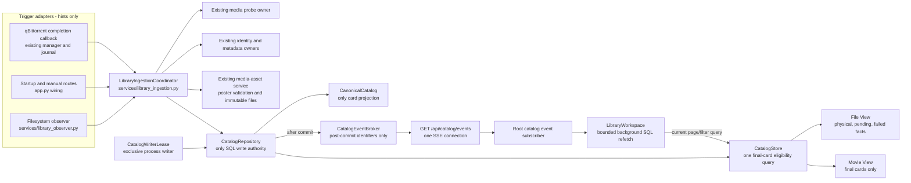

# Frozen ownership diagram

## Forbidden ownership edges

- observer -> probe/provider/SQL;
- qBittorrent job store -> catalog publication logic;
- browser event payload -> manufactured card;
- route -> route-specific reconciliation or publication rule;
- coordinator -> direct SQL connection outside `CatalogRepository`;
- Movie View -> filesystem `stat`, walk, probe, or provider;
- File View -> final-card publication decision;
- any second CP backend -> catalog write access while the lease is held.

## Existing owners deliberately preserved

The new coordinator does not absorb:

- qBittorrent runtime, submission, job journal, seeding, move/import, cleanup, collision, or restart recovery;
- canonical projection rules;
- SQL connection/transaction authority;
- media probing implementation;
- provider-specific identity matching;
- poster asset storage/serving;
- File View or shared movie-card rendering.
