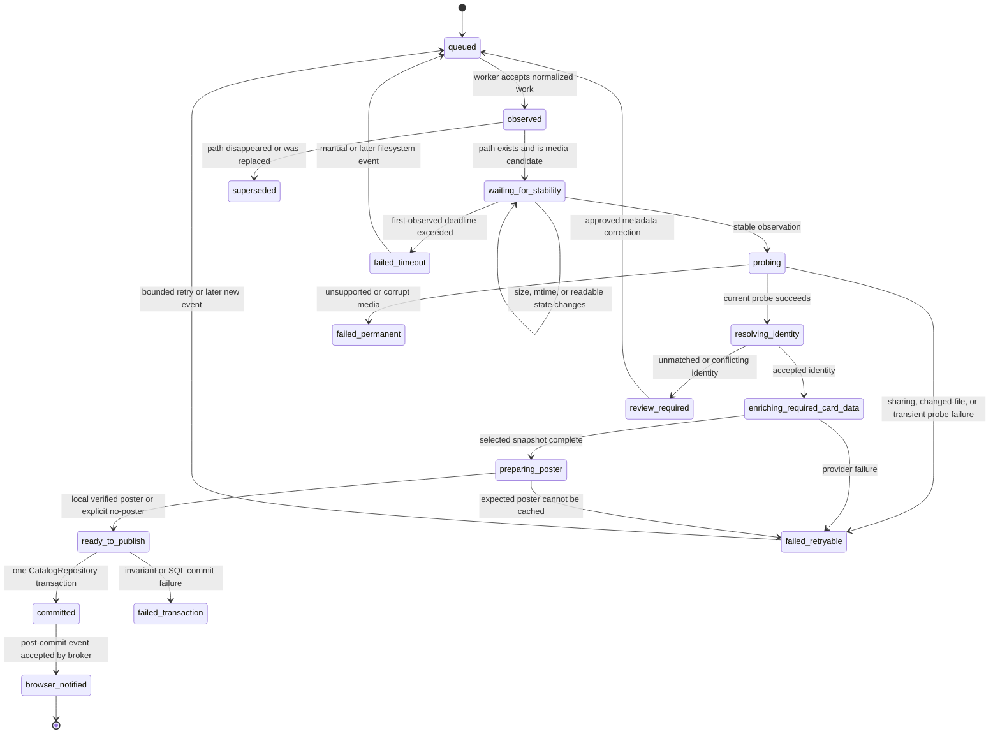

# Final-card publication state machine

## Operational states



The in-memory operational stage is persisted for File View diagnostics in the existing media-file raw JSON. Existing `ingest_status` remains the compatibility summary (`pending`, `stable`, or `failed`); no new column is required.

## Authoritative final-card predicate

`CatalogRepository.final_card_publication(paths)` owns readiness validation and the atomic publication transition. `CatalogStore` owns the canonical SQL page query and its `movie_view_publication` visibility clause. The coordinator calls the repository owner and the frontend never evaluates readiness or manufactures a card.

A path is publishable only when all conditions are true in the same proposed transaction:

### File and probe

- normalized path is contained by one configured, currently online library root;
- `ingest_status = 'stable'`;
- recorded size and modified time match the stable observation submitted to the transaction;
- `probe_status = 'ok'`;
- `probe_size = size` and `probe_modified_time = modified_time`;
- file-facts and classifier versions equal the current application constants;
- no probe error remains.

### Identity and required metadata

- `identity_status = 'accepted'` and `metadata_accepted = 1`;
- canonical `movie_key`, title, and year are non-empty;
- at least one stable provider/identity key exists;
- selected provider is non-empty and its selected snapshot is present;
- selected snapshot `details_state = 'complete'`;
- selected snapshot `people_state` is `complete` or `empty`;
- canonical `enrichment_status = 'complete'`;
- `fallback_active = false`;
- metadata contract version equals `CANONICAL_CONTRACT_VERSION` (currently 4).

Required semantic values are movie key, title, year, identity, source/selected provider, and complete snapshot state. Other typed card fields such as rating, genres, language, country, plot, and vote count may legitimately be empty only because a complete selected-provider snapshot says they are unavailable; they may not be pending placeholders.

### Poster

Exactly one terminal condition is required:

1. a selected poster asset exists with `status='ready'`, a non-empty checksum, and a locally served immutable URL; or
2. the complete selected-provider snapshot contains no usable poster URL, producing the established intentional no-poster design.

A remote URL awaiting download, failed decode, missing checksum, loading skeleton, or temporary poster is not publishable.

### Canonical projection

- the canonical movie row and file mapping exist;
- `canonical_card_projection()` returns every field in `CANONICAL_CARD_FIELDS` with the correct type;
- projection contract is `canonical_movie_card`;
- the projected local poster/no-poster state matches the poster terminal condition;
- the transaction-local query returns exactly the expected path/movie mapping.

## Atomic publication operation

Implemented repository method:

```python
CatalogRepository.final_card_publication(paths) -> list[CommittedPublication]
```

Current authoritative file, identity, provider-snapshot, canonical, and asset owners persist their stage results before publication. New ingestion records carry `movie_view_publication='pending'`, so those staged rows cannot be returned by Movie View.

Inside one final transaction the repository:

1. reads the named candidate paths and canonical projections;
2. validates current stable probe facts and version constants;
3. validates accepted identity and complete selected-provider projection;
4. validates checksum-backed local poster or explicit no-poster state;
5. changes only qualifying pending markers to `ready`;
6. advances `media_generation` exactly once when any marker changed;
7. commits both visibility and generation together.

Only after the transaction context exits successfully may the caller publish a `catalog-ready` event. An event-broker failure never rolls back or repeats the committed transaction; reconnect generation comparison recovers visibility.

This corrects the Gate 1 hypothetical all-stage bundle transaction. Holding SQLite open across probing, provider calls, or poster download would contradict current owners and increase lock duration. The final visibility transition—not incomplete staging—is the atomic Movie View publication boundary.

## Idempotency

Idempotence is enforced by the normalized path and `movie_view_publication='ready'` marker after the strict facts/projection/asset checks.

Submitting the same bundle again must produce:

- no second media-generation advance;
- no duplicate canonical mapping or asset link;
- no second browser refresh event;
- a completed/idempotent coordinator result.
